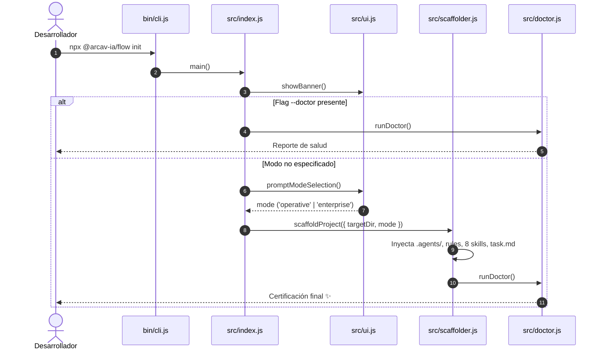

# 🏗️ Arquitectura Interna de `@arcav-ia/flow`

Este documento describe la arquitectura técnica, diseño modular y ciclo de vida de ejecución de `@arcav-ia/flow`.

---

## 🧩 Visión General de Módulos

```
arcav-ia-flow/
├── bin/cli.js           # 🚀 Shebang entrypoint ejecutable
├── src/
│   ├── index.js         # 🎛️ Orquestador y parser de argumentos CLI
│   ├── ui.js            # 🎨 Renderizado de banners y prompts TUI (zero-dependencies)
│   ├── scaffolder.js    # 📦 Motor de inyección y copiado de templates
│   ├── doctor.js        # 🩺 Diagnóstico de salud y auditoría de skills
│   └── utils.js         # 🛠️ Operaciones de FS, Git y package.json
└── templates/           # 📂 Assets canónicos empaquetados
    ├── core-skills/     # Las 8 Skills maestras
    ├── mode-operative/  # Plantillas para modo Git-First
    └── mode-enterprise/ # Plantillas para modo Plane.so
```

---

## ⚡ Principio Ponytail: Cero Dependencias de Terceros

El CLI está construido utilizando **exclusivamente las APIs estándar de Node.js 18+**:
- `node:fs` y `node:fs/promises` para operaciones de archivos y copiado recursivo (`cpSync`).
- `node:readline/promises` para interacción interactiva en terminal sin librerías pesadas.
- `node:child_process` para invocación de Git y GitHub CLI (`gh`).
- `node:path` y `node:url` para resolución de rutas ESM multiplataforma.

### ¿Por qué esta decisión?
1. **Velocidad de Descarga en `npx`:** Al pesar menos de 200KB en total, `npx @arcav-ia/flow` se descarga y arranca en **menos de 2 segundos**.
2. **Cero Superficie de Ataque:** Al no depender de `npm` packages de terceros, no existen riesgos de vulnerabilidades en cadena de suministro (*supply chain attacks*).
3. **Compatibilidad Universal:** Funciona exactamente igual en Linux, macOS y Windows.

---

## 🔄 Ciclo de Vida de Ejecución del CLI



---

## 🩺 Motor de Diagnóstico (`doctor.js`)

El subsistema de diagnóstico verifica 7 vectores críticos antes de considerar un entorno apto:
1. **Git Worktree:** Detecta si el directorio destino es un repositorio Git válido.
2. **GitHub CLI Auth:** Valida si `gh` está instalado y autenticado mediante `gh api user`.
3. **Runtime:** Registra la versión de Node.js activa.
4. **Secretos (.env):** Comprueba la existencia de `.env` y presencia de llaves requeridas.
5. **Skills Maestras:** Itera sobre `CORE_SKILLS` verificando la presencia íntegra de las 8 carpetas en `.agents/skills/`.
6. **Script de Diseño:** Confirma que `package.json` contenga `"check:design"`.
7. **Reglas de Gobernanza:** Confirma la existencia de `.agents/rules/superules.md` y `AGENTS.md`.
